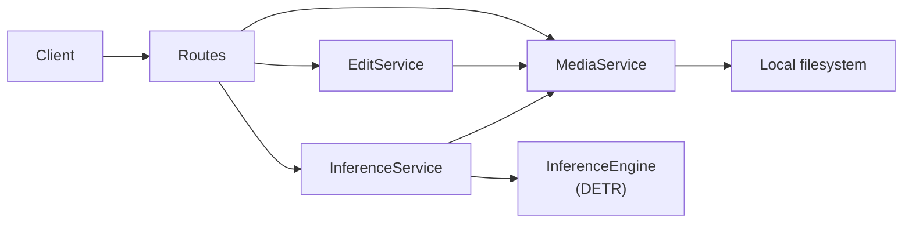

# Image Processing API

FastAPI service for uploading and managing images, applying Pillow-based transformations, and running object detection with a pretrained DETR model.

## Key features

- **Structured HTTP API** — Routes, Pydantic schemas, and OpenAPI docs at `/docs`.
- **Bounded-context architecture** — Separate `media`, `editing`, and `vision` domains, each with `api/`, `domain/`, and service layers.
- **Image lifecycle management** — Upload, list (with pagination), metadata lookup, move, delete, and bulk clear across `uploaded`, `edited`, and `detected` folders.
- **Pillow editing pipeline** — Resize, rotate, grayscale, blur, sharpen, brightness, and contrast operations.
- **DETR object detection** — Runs `facebook/detr-resnet-50` via Hugging Face Transformers at `/v1/inference/*`; returns bounding-box metadata and optional annotated images.
- **Non-blocking inference** — CPU-bound ML work runs in a thread pool behind an asyncio semaphore (`MAX_CONCURRENT_INFERENCES`).
- **Containerized deployment** — Multi-stage Dockerfile with a coverage-gated test run and health probes at `/health/live` and `/health/ready`.

## Architecture

The codebase uses vertical slices (bounded contexts) with shared infrastructure:

```
app/
├── api/routes/       # HTTP adapters (health, images, editing, inference)
├── dependencies/     # FastAPI DI wiring
├── media/            # Upload, list, delete, move
├── editing/          # Pillow transforms
├── vision/           # ML inference (engine, service, API)
├── storage/          # Filesystem abstraction
├── core/             # Config, lifespan, logging, rate limiting
└── validation/       # Upload validation
```



Images live on the local filesystem under `app/static/{uploaded,edited,detected}/`. Storage is accessed through `BaseImageStorage` with a `LocalImageStorage` implementation.

## Technical highlights

### System design
- FastAPI dependency injection wires services, repositories, and storage into route handlers.
- Per-endpoint rate limits via slowapi (e.g. `10/minute` on upload, `5/minute` on visualize).
- Domain exceptions mapped to HTTP status codes per bounded context.
- Rotating file logging via `app/core/logging_config.py`.

### ML & data
- Object detection uses `DetrImageProcessor` and `DetrForObjectDetection`; post-processing applies a configurable confidence threshold.
- Model loads at startup with optional warmup; readiness exposed at `/health/ready`.
- Inference concurrency capped by `MAX_CONCURRENT_INFERENCES` (default: 2).

### Testing
- Unit and integration tests with pytest; fast CI tier excludes slow model-download tests (`pytest -m "not inference"`).
- Integration tests use dependency overrides and mocked engines to avoid loading PyTorch in CI.

## Engineering trade-offs

| Decision | Chosen | Rationale |
|---|---|---|
| Storage | Local filesystem + abstract interface | Self-contained deployment; `BaseImageStorage` preserves a migration path. |
| Detection model | Pretrained DETR | Zero training infra; COCO-pretrained weights cover general object classes. |
| Concurrency | Async routes + semaphore + `asyncio.to_thread()` | Keeps the event loop free while capping parallel inference. |
| Model loading | Startup load + warmup | Predictable readiness checks; first boot pays download cost once. |

## Tech stack

Python 3.12 · FastAPI · Uvicorn · Pydantic / pydantic-settings · Pillow · PyTorch · Hugging Face Transformers · slowapi · pytest · Docker

## Quick start

### Docker (recommended)

```bash
docker-compose -f docker-compose.dev.yml up --build
```

API: [http://localhost:8000](http://localhost:8000) · Docs: [http://localhost:8000/docs](http://localhost:8000/docs)

### Manual setup

```bash
python -m venv venv
source venv/bin/activate
pip install -r requirements.txt
cp .env-example .env
uvicorn app.main:app --reload
```

Upload an image:

```bash
curl -X POST "http://localhost:8000/images" \
  -F "file=@photo.jpg" \
  -F "filename=my_photo" \
  -F "format=JPEG"
```

Run object detection:

```bash
curl -X POST "http://localhost:8000/v1/inference/detect" \
  -F "file=@photo.jpg"
```

Run tests:

```bash
pytest -m "not inference"
```

Further setup, API reference, and deployment notes: [`docs/`](docs/README.md).

## License

[GNU License](LICENSE)
