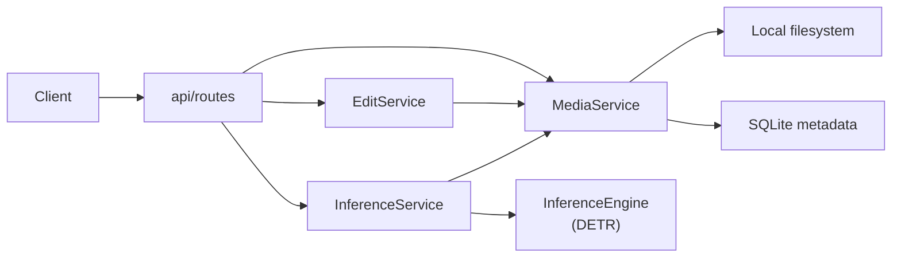

# Image Processing API

FastAPI service for uploading and managing images, applying Pillow-based transformations, and running COCO-pretrained object detection with DETR.

## Key features

- **Structured HTTP API** — FastAPI routes with Pydantic request/response models and OpenAPI docs at `/docs` (`app/main.py`, `app/api/routes/`).
- **Bounded-context layout** — Separate `media`, `editing`, and `vision` packages, each with `api/`, `domain/`, and service layers (`docs/ARCHITECTURE.md`).
- **Image lifecycle with metadata** — Upload, paginated list, lookup, move, delete, and bulk clear across `uploaded`, `edited`, and `detected` folders; SQLite records track dimensions, format, and content hash (`app/media/service.py`, `app/models/image.py`).
- **Content-hash deduplication** — Re-uploading identical bytes in the same folder returns the existing record instead of writing a duplicate file (`app/media/service.py`, `app/media/utils/hash.py`).
- **Pillow editing pipeline** — Resize, rotate, grayscale, blur, sharpen, brightness, and contrast; outputs saved to the `edited` folder (`app/editing/operations.py`, `app/editing/service.py`).
- **DETR object detection** — Runs `facebook/detr-resnet-50` via Hugging Face Transformers at `/v1/inference/*`; returns bounding-box metadata and optional annotated images (`app/vision/inference/engine.py`).
- **Capped inference concurrency** — CPU-bound detection runs in a thread pool behind an `asyncio` semaphore (`MAX_CONCURRENT_INFERENCES`, default 2) (`app/dependencies/inference.py`).

## Architecture

The API is a single FastAPI process organized as vertical slices with shared infrastructure (`core/`, `dependencies/`, `storage/`, `db/`). HTTP adapters in `app/api/routes/` delegate to domain services; blocking work (filesystem I/O, Pillow, PyTorch) is offloaded with `asyncio.to_thread()`.

Image bytes live on the local filesystem under `app/static/{uploaded,edited,detected}/`. Metadata and uniqueness constraints are stored in SQLite via SQLAlchemy. Storage is accessed through `BaseImageStorage`, with `LocalImageStorage` as the only implementation today.

The DETR model loads once at startup (optional warmup); readiness is exposed at `/health/ready` (`app/core/lifespan.py`, `app/api/routes/health.py`).



## Technical highlights

### System design
- FastAPI dependency injection wires repositories, storage, and services into route handlers (`app/dependencies/`).
- Per-endpoint rate limits via slowapi decorators and `SlowAPIMiddleware` (`app/core/rate_limiting.py`, `app/main.py`).
- Domain exceptions in each bounded context map to HTTP status codes via registered handlers (`app/media/api/handlers.py`, `app/editing/api/handlers.py`, `app/vision/api/handlers.py`).
- Filename sanitization and resolved-path containment checks prevent path traversal on storage writes (`app/media/utils/filename.py`, `app/storage/local_storage.py`).
- Rotating file logging to `logs/app.log` (`app/core/logging_config.py`).

### ML & data
- Detection pipeline: preprocess (optional downscale) → `DetrForObjectDetection` → thresholded post-processing → DTO mapping (`app/vision/inference/preprocessor.py`, `postprocessor.py`, `engine.py`).
- Configurable `CONFIDENCE_THRESHOLD`, `MAX_IMAGE_DIMENSION`, and `INFERENCE_DEVICE` (`app/core/config.py`).
- Annotated outputs can be returned as base64 or persisted to the `detected` folder (`app/vision/service.py`, `app/vision/inference/visualizer.py`).

### DevOps
- Dockerfile runs the fast test suite with an 80% coverage gate before producing the runtime image (`Dockerfile` line 24).
- GitHub Actions runs `pytest -m "not inference"` with ruff, mypy, and the same coverage threshold on push and pull request (`.github/workflows/test.yml`).
- Nightly/manual workflow runs real-model inference smoke tests (`.github/workflows/test-inference.yml`).
- Production `docker-compose.yml` mounts named volumes for image folders and configures a readiness healthcheck.

### Testing
- Unit and integration tests under `tests/`; fast CI mocks only the DETR model weights, not media or editing services (`tests/conftest.py`).
- Full-stack integration tests use real SQLite, storage, and services via `test_client_full_stack` (`tests/integration/test_end_to_end.py`).
- Real-model smoke tests use `@pytest.mark.inference` (`tests/inference/`); run locally with `pytest -m inference --no-cov`. Nightly/manual CI: `.github/workflows/test-inference.yml`.

## Engineering trade-offs

| Decision | Chosen | Rationale |
|---|---|---|
| Storage | Local filesystem behind `BaseImageStorage` | Self-contained deployment; see [ADR 001](docs/adr/001-local-filesystem-storage.md) for rationale and migration path. |
| Image metadata | SQLite + content-hash uniqueness | Supports list/filter/move without scanning the filesystem; deduplicates uploads per folder. |
| Detection model | Pretrained DETR (`facebook/detr-resnet-50`) | No training infrastructure; COCO weights cover general object classes out of the box. |
| Model lifecycle | Load at startup + optional warmup | Predictable `/health/ready` checks; first boot pays Hugging Face download cost once. |
| Concurrency | Async routes + `asyncio.to_thread()` + inference semaphore | Keeps the event loop responsive while bounding parallel CPU-bound inference. |

## Tech stack

Python 3.12 · FastAPI · Uvicorn · Pydantic / pydantic-settings · SQLAlchemy · Pillow · PyTorch · Hugging Face Transformers · slowapi · pytest · Docker

## Quick start

### Docker (recommended)

```bash
docker-compose -f docker-compose.dev.yml up --build
```

API: http://localhost:8000 · Docs: http://localhost:8000/docs

### Manual setup

```bash
python3 -m venv venv
source venv/bin/activate
pip install -e ".[test]"
cp .env.example .env
uvicorn app.main:app --reload
```

Required configuration lives in `.env` (copy from `.env.example`). Common knobs: `LOG_LEVEL`, `MAX_UPLOAD_SIZE_MB`, `MAX_CONCURRENT_INFERENCES`, `MODEL_NAME`, `INFERENCE_DEVICE`, `DATABASE_URL`.

Upload an image:

```bash
curl -X POST "http://localhost:8000/images" \
  -F "file=@photo.jpg" \
  -F "filename=my_photo" \
  -F "format=JPEG"
```

End-to-end workflow (upload → resize → detect with visualization):

```bash
# 1. Upload
curl -X POST "http://localhost:8000/images" \
  -F "file=@photo.jpg" \
  -F "filename=demo" \
  -F "format=JPEG"

# 2. Resize (reads from uploaded/, writes to edited/)
curl -X POST "http://localhost:8000/images/demo.jpg/edits/resize?width=400&height=300"

# 3. Detect on a fresh upload and persist annotated output to detected/
curl -X POST "http://localhost:8000/v1/inference/detect/visualize?persist=true" \
  -F "file=@photo.jpg"
```

Run object detection only:

```bash
curl -X POST "http://localhost:8000/v1/inference/detect" \
  -F "file=@photo.jpg"
```

Run tests (matches CI and Docker build gate):

```bash
pytest -m "not inference"
```

Run real-model inference smoke tests (slow; downloads DETR weights on first run):

```bash
pytest -m inference --no-cov
```

Further setup, API reference, and deployment notes: [`docs/`](docs/README.md).

## What makes this project non-trivial

The service combines three concerns—filesystem-backed media management, a Pillow transform pipeline, and a Hugging Face DETR inference path—behind a consistent bounded-context structure rather than a single monolithic module. Upload deduplication, SQLite metadata with folder-scoped uniqueness constraints, and per-domain exception mapping reflect deliberate API design beyond a tutorial CRUD app. Inference is integrated into the same process with startup loading, semaphore-limited thread offload, and readiness probes suitable for container orchestration. Test coverage is enforced at 80% in both CI and the Docker build.

## License

[GNU General Public License v3.0](LICENSE)
