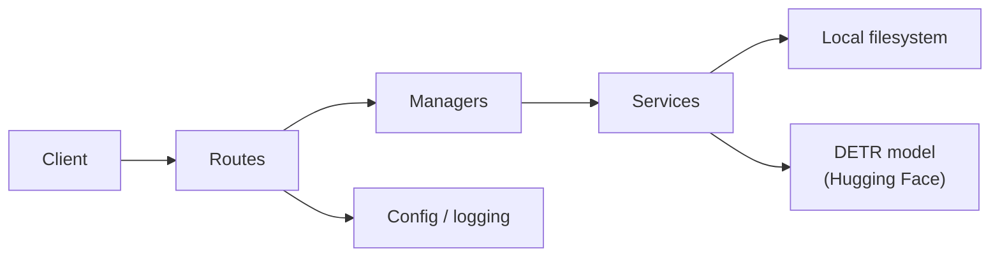

# Image Processing API

FastAPI service for uploading and managing images, applying Pillow-based transformations, and running object detection with a pretrained DETR model.

## Key features

- **Structured HTTP API** — Routes, Pydantic schemas, and OpenAPI docs at `/docs` (`app/main.py`, `app/schemas/`).
- **Layered request handling** — Routes delegate to managers, which coordinate services for CRUD, editing, and detection (`app/managers/`, `app/services/`).
- **Image lifecycle management** — Upload, list (with pagination), metadata lookup, move, delete, and bulk clear across `uploaded`, `edited`, and `detected` folders (`app/api/routes/image_routes.py`, `app/services/image/crud_operations.py`).
- **Pillow editing pipeline** — Resize, rotate, grayscale, blur, sharpen, brightness, and contrast operations via a shared `_process_image` helper (`app/services/image/image_editor.py`).
- **DETR object detection** — Runs `facebook/detr-resnet-50` through Hugging Face Transformers; returns bounding-box metadata and optional annotated images at confidence ≥ 0.5 (`app/services/detection/detection_service.py`).
- **Non-blocking route handlers** — CPU-bound and I/O work runs in thread pools via `asyncio.to_thread()` so the event loop stays free (`app/api/routes/`).
- **Containerized deployment** — Multi-stage Dockerfile runs the test suite at build time (80% coverage gate), strips dev dependencies, and exposes a `/health` endpoint for orchestration (`Dockerfile`, `docker-compose.yml`).

## Architecture

The codebase follows a four-layer layout: API routes → managers → services → core/utils. Routes validate input and map HTTP concerns; managers orchestrate multi-step workflows; services hold domain logic (storage, editing, inference); core provides config, logging, and shared dependencies.

Images live on the local filesystem under `app/static/{uploaded,edited,detected}/`. Storage is accessed through a `BaseImageStorage` abstract class with a `LocalImageStorage` implementation, leaving a seam for a different backend later without rewriting managers.



## Technical highlights

### System design
- FastAPI dependency injection wires validators, storage, CRUD, editors, and detection services into route handlers (`app/core/dependencies.py`, `app/core/config.py`).
- Per-endpoint rate-limit strings are declared with slowapi decorators (e.g. `10/minute` on upload, `5/minute` on detection) (`app/core/rate_limiting.py`, route modules).
- File logging to `logs/app.log` with module-level loggers (`app/core/logging_config.py`).

### ML & data
- Object detection uses `DetrImageProcessor` and `DetrForObjectDetection` from Transformers; post-processing applies a 0.5 confidence threshold (`app/services/detection/detection_service.py`).
- Annotated outputs use luminance-aware label colors and random box colors drawn with Pillow (`detection_service.py`).

### DevOps
- Docker Compose configs for dev (bind mounts, hot reload) and prod (named volumes, restart policy) (`docker-compose.dev.yml`, `docker-compose.yml`).
- Dockerfile healthcheck hits `/health`; production compose mirrors the same check.

### Testing
- 15 test modules with unit and integration coverage; pytest configured for 80% minimum coverage (`tests/`, `pytest.ini`, `.coveragerc`).
- Integration tests use dependency overrides and mocked detection to avoid loading PyTorch in CI-like runs (`tests/conftest.py`).

## Engineering trade-offs

| Decision | Chosen | Alternatives considered | Rationale |
|---|---|---|---|
| Storage | Local filesystem + abstract interface | Cloud object storage (S3, etc.) | Keeps deployment self-contained; `BaseImageStorage` preserves a migration path (`app/services/image/storage/`). |
| Detection model | Pretrained DETR (`facebook/detr-resnet-50`) | Custom training / lighter detectors | Zero training infra; COCO-pretrained weights cover general object classes out of the box. |
| Concurrency model | Async routes + `asyncio.to_thread()` | Fully synchronous handlers | Lets FastAPI accept concurrent requests while Pillow and PyTorch run off the event loop. |
| Model loading | Initialized in `ObjectDetectionService.__init__` | Lazy load on first inference call | Simpler construction path; first request after startup pays download + load cost. Hugging Face caches weights on disk after the initial fetch. |

## Tech stack

Python 3.12 · FastAPI · Uvicorn · Pydantic / pydantic-settings · Pillow · PyTorch · Hugging Face Transformers · slowapi · pytest · Docker / Docker Compose

## Quick start

### Docker (recommended)

Development with hot reload:

```bash
docker-compose -f docker-compose.dev.yml up --build
```

Production-style run:

```bash
docker-compose -f docker-compose.yml up --build -d
```

API: [http://localhost:8000](http://localhost:8000) · Interactive docs: [http://localhost:8000/docs](http://localhost:8000/docs)

### Manual setup

```bash
python -m venv venv
source venv/bin/activate
pip install -r requirements.txt
cp .env-example .env
uvicorn app.main:app --reload
```

Upload an image:

```bash
curl -X POST "http://localhost:8000/images" \
  -F "file=@photo.jpg" \
  -F "filename=my_photo" \
  -F "format=JPEG"
```

Run tests:

```bash
pytest
```

Further setup, API reference, and deployment notes: [`docs/`](docs/README.md).

## What makes this project non-trivial

This is a single-process FastAPI application, not a distributed system — but it goes beyond a tutorial CRUD demo in several ways. The codebase separates routes, managers, and services with dependency injection across ~15 modules, integrates a real transformer-based detector (PyTorch + Transformers), and wraps synchronous image/ML work for async concurrency. The Docker build bakes in a coverage-gated test run before shipping a slim runtime image. Documentation spans architecture, API, deployment, and per-module READMEs under `app/`.

## License

[GNU License](LICENSE)
